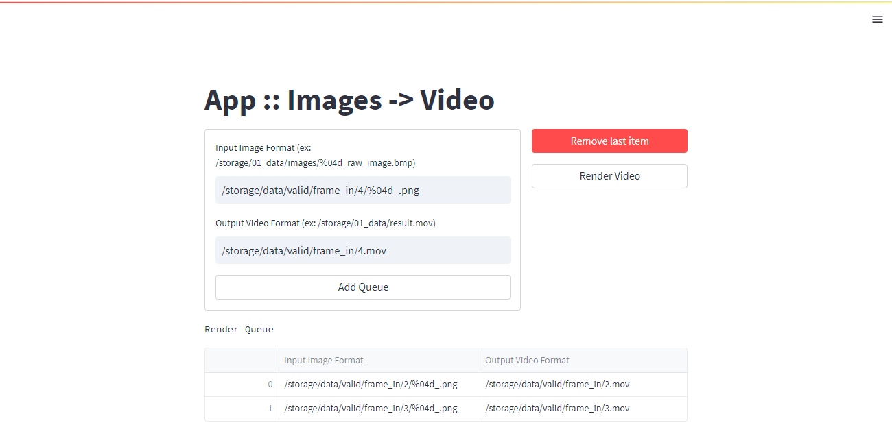

# App.ImagesToVideoGenerator

FFmpeg을 사용하여 Image들을 Video로 변환합니다.



## Setup

[Setup](./doc/setup.md)

## How To Use

### Start Application

```bash
pipenv run streamlit run main.py
```

### Use Application

> **Input Image Format**
> 
> 이미지 리스트를 생성하기 위해 unix 스타일의 파일 패턴을 입력합니다.
> 
> 내부적으로 [glob](https://docs.python.org/3/library/glob.html)를 사용합니다.

> **Output Video Format**
> 
> 비디오를 저장할 경로를 입력합니다.

> **Add Queue**
> 
> Render Queue에 입력한 데이터를 집어넣습니다.

> **Remove Last Item**
> 
> Render Queue에 마지막 아이템을 삭제합니다.

> **Render Video**
> 
> Render Queue에 있는 요소들로 렌더링을 시작합니다. 렌더링은 순차적으로 진행됩니다.
